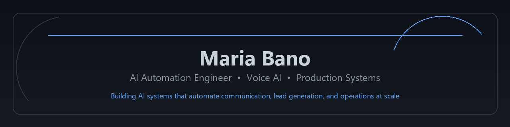

# Maria Bano

### AI Automation Engineer • Voice AI Engineer • AI Systems Builder

 

Building production-grade AI systems, voice agents, and automation platforms that help businesses automate communication, lead generation, and customer operations at scale.

 

 

 

---

## About Me

I design and build **AI systems that move business metrics** — not demos that sit in a slide deck.

| System | Business Outcome |
|--------|------------------|
| **AI Voice Agents** | 24/7 inbound handling, qualification, and booking without adding headcount |
| **Lead Automation Systems** | Faster outreach cycles, consistent follow-ups, fewer dropped opportunities |
| **AI Assistants** | Instant answers grounded in business data — policies, products, and operations |
| **RAG Applications** | Maintainable knowledge layers that update without redeploying models |
| **SaaS Platforms** | Multi-tenant products with auth, analytics, and production-grade workflows |
| **Workflow Automation Systems** | End-to-end pipelines that replace manual ops across CRM, email, and APIs |

---

## Focus Areas

| Area | What I Build |
|:-----|:-------------|
| **Voice AI** | Production voice agents for reception, qualification, booking, and follow-up |
| **Automation Engineering** | n8n and API-driven pipelines for lead gen, outreach, and operational workflows |
| **LLM Systems** | RAG pipelines, tool orchestration, and assistants grounded in live business data |
| **SaaS Development** | Full-stack platforms — dashboard, backend, auth, scheduling, and analytics |
| **CRM Automation** | Connected systems across Gmail, CRM, webhooks, and downstream integrations |
| **Business Workflows** | Structured state machines for campaigns, bookings, replies, and handoffs |

---

## Current Focus

🚀 Building production-grade **AI Voice Agents**

🚀 Designing **AI-powered outreach systems** for B2B lead generation

🚀 Building **automation systems** with n8n and REST APIs

🚀 Exploring **agentic workflows** and multi-agent architectures

---

## Technology Stack

### AI & LLMs

### Voice AI

### Automation

### Backend

### Database

### DevOps

---

## Featured Projects

<strong>Project Details</strong>

 

### LeadMaster-SaaS

**Description:** Multi-tenant B2B outreach platform — lead import, AI personalization, Gmail delivery, follow-up sequences, and campaign analytics.

**Technologies:** React · FastAPI · Supabase · n8n · OpenAI · Gmail API

**Business Impact:** Replaces spreadsheet-driven outreach with a unified pipeline from lead import to reply tracking — scalable personalization without manual copywriting per prospect.

**Repository:** [github.com/Maria-Bano/LeadMaster-SaaS](https://github.com/Maria-Bano/LeadMaster-SaaS)

---

### AI-Voice-Receptionist

**Description:** Production-style AI voice receptionist for hotel front-desk — live inventory checks, RAG policy answers, and automated booking workflows.

**Technologies:** Vapi · n8n · RAG · MCP-style tool orchestration · Google Sheets · API integrations

**Business Impact:** Extends front-desk coverage beyond staffed hours, reduces repetitive inquiry load, and validates availability against live inventory to lower double-booking risk.

**Repository:** [github.com/Maria-Bano/AI-Voice-Receptionist](https://github.com/Maria-Bano/AI-Voice-Receptionist)

---

### ShopMind AI Recommendation Engine

**Description:** Django e-commerce platform with behavior-driven product recommendations — tracks user interactions and ranks products by relevance.

**Technologies:** Python · Django · SQLite · Rule-based reasoning · User behavior analytics

**Business Impact:** Moves product discovery beyond static listings — surfaces relevant items from browsing patterns to improve engagement and conversion potential.

**Repository:** [github.com/Maria-Bano/ShopMind-ai-product-recommendation-engine](https://github.com/Maria-Bano/ShopMind-ai-product-recommendation-engine)

---

### Image Caption Generator

**Description:** Deep learning pipeline that generates human-like image captions using VGGNet feature extraction and Bidirectional LSTM sequence generation.

**Technologies:** Python · TensorFlow/Keras · VGGNet · BiLSTM · Flickr8k dataset

**Business Impact:** Automates image-to-text generation for content workflows — reducing manual captioning effort while maintaining semantic accuracy.

**Repository:** [github.com/Maria-Bano/Image-Caption-Generator](https://github.com/Maria-Bano/Image-Caption-Generator)

---

## Project Highlights

| Project | Problem Solved | Technologies | Impact |
|:--------|:---------------|:-------------|:-------|
| **LeadMaster-SaaS** | B2B teams lose hours on manual lead lists, generic emails, and missed follow-ups across disconnected tools | React · FastAPI · Supabase · n8n · OpenAI · Gmail API | Unified outreach lifecycle — import, personalize, send, follow up, and measure in one platform |
| **AI-Voice-Receptionist** | Hotel front desks face high-volume policy and availability questions with stale data and after-hours gaps | Vapi · n8n · RAG · MCP-style tools · Google Sheets | Live inventory-backed voice answers and booking workflows with maintainable policy knowledge |
| **ShopMind** | E-commerce sites show identical product lists regardless of user interest or browsing behavior | Django · Python · Rule-based AI · Behavior tracking | Personalized recommendations driven by interaction data instead of static catalog views |

---

## Engineering Philosophy

I believe AI systems should:

- **Solve real business problems** — tied to revenue, operations, or customer experience
- **Automate repetitive work** — so teams focus on decisions, not data entry
- **Be production-ready** — auth, error handling, observability, and clear system boundaries
- **Scale reliably** — structured workflows and live data over brittle prompt-only logic
- **Deliver measurable outcomes** — reply rates, coverage hours, booking accuracy, not vanity demos

---

## GitHub Stats

---

## Achievements

> Metrics reflect documented portfolio systems and public repository activity — not inflated client claims.

---

## Currently Learning

- Agentic AI Systems
- Multi-Agent Architectures
- Production LLM Evaluation
- Advanced RAG Systems
- Scalable SaaS Architecture

---

## Let's Connect

If you're building AI products, automating operations, or exploring Voice AI solutions — I'd welcome a conversation.

 

AI Automation Engineer · Voice AI · SaaS · Production Systems

